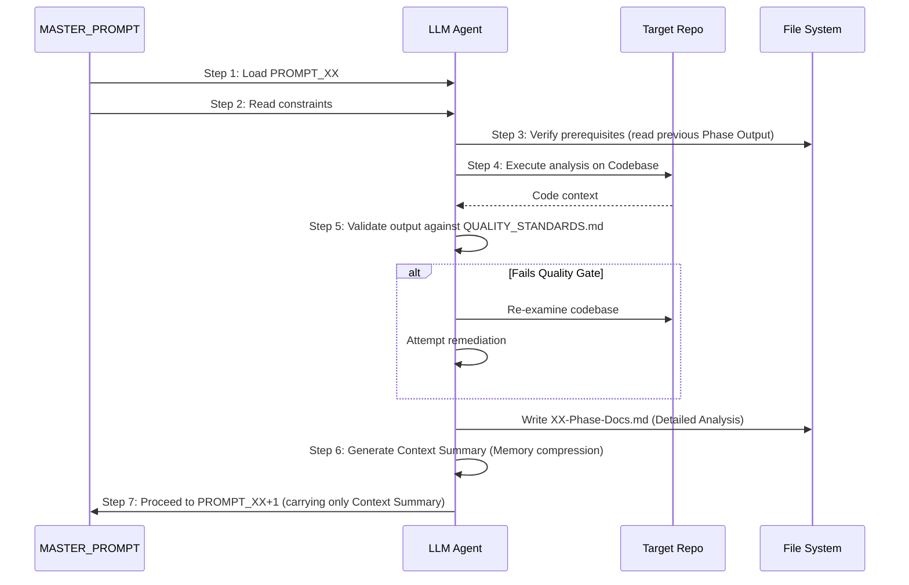
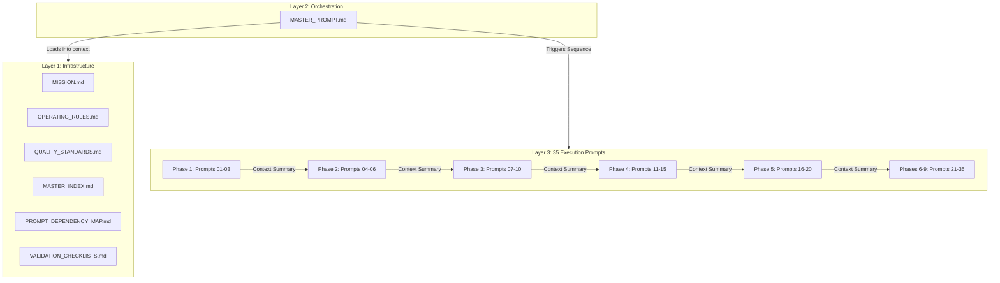

# 05-diagrams

## Context Management Lifecycle (Sequence Diagram)
This diagram illustrates the crucial 7-step loop dictated by `MASTER_PROMPT.md` to prevent context window overflow when orchestrating the 35 execution prompts.

*Caption: The execution loop that compresses detailed analysis into a "Context Summary" before transitioning to the next phase. This is the core architectural innovation of the Hermes canonical framework that allows it to process large repositories without hallucinating.*

## Framework Component Diagram
This diagram illustrates the logical separation of concerns within the prompt framework itself.

*Caption: The three-layer architecture of the prompt framework. Note how data is passed between the 35 execution prompts via the Context Summary mechanism.*
